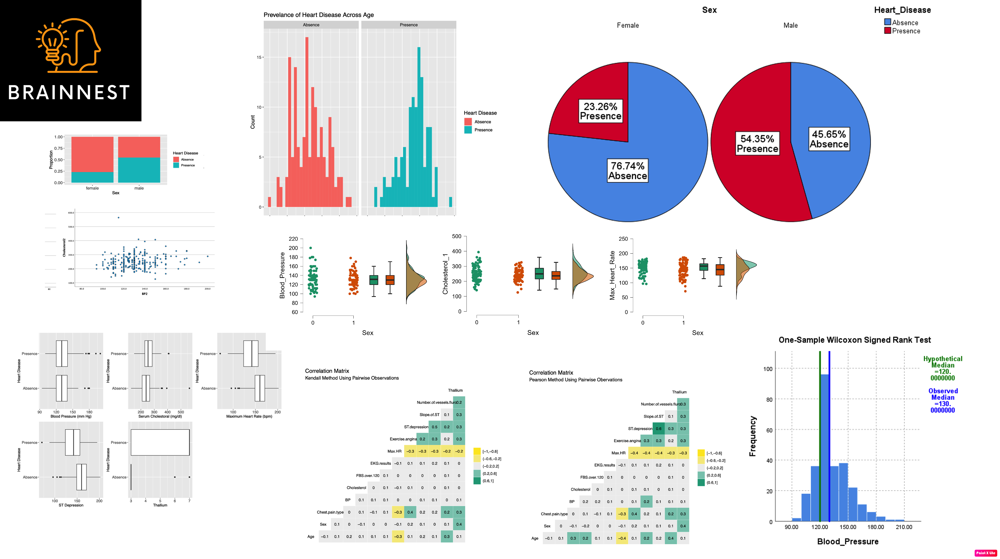

# Portfolio

---

### Category Name 1 

[Project 1 Udacity Data Analyst NanoDegree](https://github.com/CarlaML01/projects/blob/main/Project%20TMDb%20movie%20dataset%20-%20final.ipynb)
Project TMDb movie dataset.

---
[Project 2 Brainnest - Data Analysis Industrial Traineeship](/pdf/project report_final_Brainnest-Carla.pdf)
Detailed data analysis project from Heart Disease Data Set [Source](https://archive.ics.uci.edu/ml/datasets/heart+disease). 
Main tools: R, SPSS, Excel and Tableau.

---
[Project 3 Bio-DATA project](/pdf/project 1.pdf)

---

### Published DATA

- [Article 1](https://doi.org/10.3390/plants11151924)
- [Article 2](https://doi.org/10.3389/fmicb.2022.1007935)

---

---

Page template forked from <a href="https://github.com/evanca/quick-portfolio">evanca</a>

<!-- Remove above link if you don't want to attibute -->
