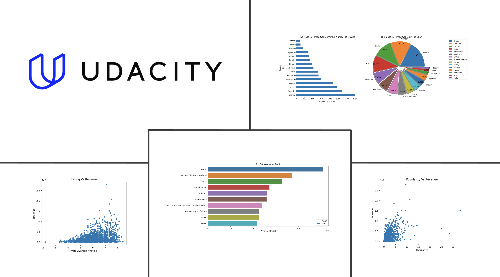
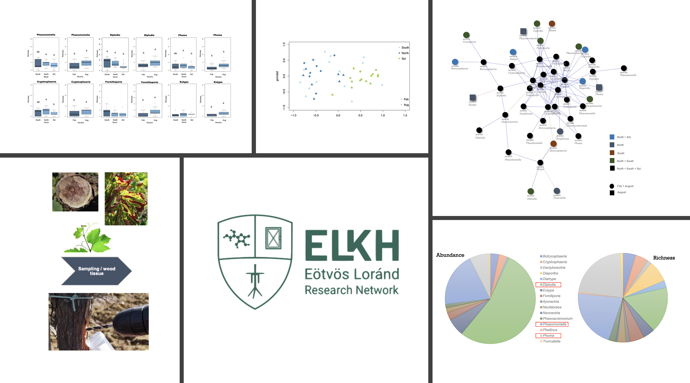

# Portfolio

---

### Recent projects: 

### [Project 1 Udacity Advanced Data Analyst NanoDegree](https://github.com/CarlaML01/projects/blob/main/Project%20TMDb%20movie%20dataset%20-%20final.ipynb)
TMDb movie dataset.

---
### [Project 2 Brainnest - Data Analysis Industrial Traineeship](https://github.com/CarlaML01/CarlaML01.github.io/blob/e5e888f217c120e8498f98d326a584f5bcfa3d7a/pdf/project%20report_final_Brainnest-Carla.pdf) 
Detailed data analysis project from Heart Disease Data Set [Source](https://archive.ics.uci.edu/ml/datasets/heart+disease).\
Main tools: R, SPSS, Excel and Tableau. 

---
### [Project 3 Bio-DATA project](https://github.com/CarlaML01/CarlaML01.github.io/blob/e5e888f217c120e8498f98d326a584f5bcfa3d7a/pdf/project%201.pdf)
Data Research assistant work project.\

---

### Published DATA

- [Article 1](https://doi.org/10.3390/plants11151924)
- [Article 2](https://doi.org/10.3389/fmicb.2022.1007935)

---

---

Page template forked from <a href="https://github.com/evanca/quick-portfolio">evanca</a>

<!-- Remove above link if you don't want to attibute -->
